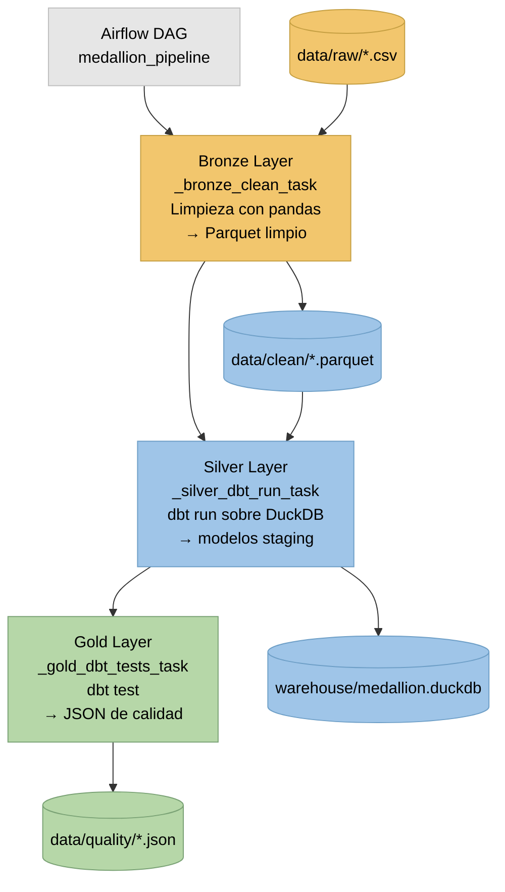

Medallion Pipeline – Examen Ingeniería de Software y Datos
===========================================================

Este repositorio implementa un pipeline basado en la arquitectura Medallion (Bronze → Silver → Gold), utilizando Apache Airflow para la orquestación, dbt con DuckDB para el modelado de datos y pandas para la limpieza en la capa Bronze.

El objetivo del examen consiste en completar y poner en funcionamiento todo el workflow, resolviendo los TODOs provistos y documentando las decisiones de implementación.

# 1. Ejecución del repositorio
----------------------------

### 1.1 Requisitos previos

El proyecto está diseñado para ejecutarse utilizando Docker a fin de garantizar un entorno reproducible, independiente del sistema operativo.

Requisitos:

- Docker Desktop  
- Docker Compose v2  
- En Windows, se recomienda la utilización de WSL2, aunque no es estrictamente necesario mientras Docker pueda montar volúmenes correctamente.

### 1.2 Clonado del repositorio

```
git clone https://github.com/plorenzatto/examen_ing_de_sw_n_data_final.git
cd examen_ing_de_sw_n_data_final
```

### 1.3 Levantar el entorno

Ejecutar:

```
docker compose up
```

Esto inicia:

- Airflow Webserver  
- Airflow Scheduler  
- Airflow Triggerer  
- Airflow Dag Processor  
- Base de datos interna  
- Entorno de dbt con DuckDB  

La interfaz web de Airflow se encuentra en:  
http://localhost:8080

### 1.4 Usuario y contraseña

Airflow genera una contraseña almacenada en:

```
/opt/airflow/simple_auth_manager_passwords.json.generated
```

Para obtenerla:

```
docker exec -it airflow-medallion cat /opt/airflow/simple_auth_manager_passwords.json.generated
```

# 2. Estructura del repositorio
-----------------------------

```
├── dags/
│   └── medallion_medallion_dag.py
├── src/
│   └── transformations.py
├── tests/                              # Tests unitarios de Python
│   ├── __init__.py
│   ├── conftest.py
│   └── test_transformations.py
├── dbt/
│   ├── models/
│   │   ├── staging/stg_transactions.sql
│   │   ├── marts/fct_customer_transactions.sql
│   │   └── schema.yml
│   ├── tests/
│   │   ├── generic/non_negative.sql
│   │   └── singular/                   # Tests singulares de dbt
│   │       ├── assert_total_amount_all_gte_completed.sql
│   │       ├── assert_transaction_count_positive.sql
│   │       ├── assert_staging_amounts_match_mart_totals.sql
│   │       ├── assert_transaction_date_not_future.sql
│   │       └── assert_customer_count_consistency.sql
│   └── profiles/
├── data/
│   ├── raw/
│   ├── clean/
│   └── quality/
├── warehouse/
│   └── medallion.duckdb
├── pytest.ini                          # Configuración de pytest
└── docker-compose.yml
```

# 3. Resolución de los TODOs del examen
-------------------------------------

### 3.1 Implementación de tareas de Airflow

El DAG `medallion_pipeline` implementa tres tareas:

- `bronze_clean`: limpieza de datos con pandas y generación de archivos parquet.  
- `silver_dbt_run`: ejecución de modelos dbt sobre DuckDB.  
- `gold_dbt_tests`: ejecución de pruebas dbt y generación de reportes de calidad.

El DAG cuenta con:

```
schedule = "0 6 * * *"
start_date = pendulum.datetime(2025, 12, 1, tz="UTC")
catchup = True
max_active_runs = 1
```

Esto habilita la ejecución automática diaria y la recomputación de fechas anteriores.

### 3.2 Implementación de los modelos dbt según schema.yml

Se completaron:

- `stg_transactions.sql` (Silver / staging)  
- `fct_customer_transactions.sql` (Gold / marts)

Los modelos cumplen con las definiciones y tipos especificados.

### 3.3 Implementación de pruebas dbt

Las pruebas incluidas en `schema.yml` validan:

- unicidad  
- no-nulidad  
- valores aceptados  
- no-negatividad  

La tarea Gold genera:

```
data/quality/dq_results_<ds_nodash>.json
```

Si alguna prueba falla, el task termina en error.

### 3.4 Tests a medida (Custom Tests)

Se implementaron tests en dos niveles: unit tests de Python para la capa Bronze y tests singulares de dbt para validar la integridad entre capas.

#### 3.4.1 Unit Tests de Python (pytest)

Los tests unitarios validan el comportamiento de las funciones de transformación en `src/transformations.py`:

**Ubicación:** `tests/test_transformations.py`

**Funciones testeadas:**

1. **`_coerce_amount`**: Conversión de valores a numéricos
   - Valores numéricos válidos (integers, floats, strings numéricos)
   - Manejo de valores inválidos (NaN para strings no numéricos, valores nulos)
   - Casos borde (series vacías, valores con símbolos de moneda)

2. **`_normalize_status`**: Normalización de estados de transacción
   - Normalización de mayúsculas/minúsculas
   - Limpieza de espacios en blanco
   - Mapeo de valores inválidos a None

3. **`clean_daily_transactions`**: Pipeline de limpieza completo
   - Generación correcta de archivos parquet
   - Normalización de nombres de columnas
   - Eliminación de duplicados
   - Derivación del campo `transaction_date`
   - Manejo de errores (archivo no encontrado)
   - Creación automática de directorios

**Ejecución de los tests:**

```bash
# Desde el directorio raíz del proyecto
pip install -r requirements.txt
pytest -v

# Con reporte de cobertura
pytest --cov=src --cov-report=term-missing
```

**Estructura de los tests:**

```
tests/
├── __init__.py
├── conftest.py          # Configuración de pytest y fixtures globales
└── test_transformations.py  # Tests unitarios para transformations.py
```

#### 3.4.2 Tests Singulares de dbt (Data Quality)

Se implementaron tests singulares de dbt que validan reglas de negocio específicas y la integridad entre capas del pipeline.

**Ubicación:** `dbt/tests/singular/`

| Test | Descripción | Capa validada |
|------|-------------|---------------|
| `assert_total_amount_all_gte_completed.sql` | Valida que `total_amount_all >= total_amount_completed` (la suma total no puede ser menor que solo los completados) | Gold |
| `assert_transaction_count_positive.sql` | Valida que cada cliente tenga al menos una transacción (count >= 1) | Gold |
| `assert_staging_amounts_match_mart_totals.sql` | Valida consistencia: suma de montos en staging = suma en mart | Silver → Gold |
| `assert_transaction_date_not_future.sql` | Valida que no existan transacciones con fecha futura | Silver |
| `assert_customer_count_consistency.sql` | Valida que la cantidad de clientes únicos sea igual entre staging y mart | Silver → Gold |

**Ejecución de los tests de dbt:**

```bash
cd dbt
DBT_PROFILES_DIR=../profiles dbt test
```

#### 3.4.3 Prácticas de Testing

Los tests siguen las prácticas de ingeniería de software:

- **Unit tests con pytest**: Utilizan table-driven tests para cubrir distintos escenarios.
- **Fixtures**: Se usan fixtures de pytest para crear datos de prueba y directorios temporales.
- **Aislamiento**: Cada test es independiente y no depende del estado de otros tests.
- **Tests singulares de dbt**: Validan reglas de negocio que no pueden expresarse solo con tests del schema.yml.
- **Tests de integridad entre capas**: Verifican que los datos se transformen correctamente de Bronze a Silver a Gold.

### 3.5 Mejoras posibles (escalabilidad y modelado)

#### 3.5.1 Separación de ambientes y modularización

- Separar Airflow y dbt en contenedores independientes.  
- Ejecutar dbt de forma remota (dbt Cloud, runner dedicado).  
- Desacoplar el data warehouse.

#### 3.5.2 Migración a data warehouse escalable

Opciones:

- Amazon Redshift  
- BigQuery  
- Snowflake  

Permiten particionamiento, clustering y escalado automático.

#### 3.5.3 Particionamiento en Silver y Gold

- Particionar por `transaction_date`.  
- Implementar modelos incrementalizados.

#### 3.5.4 Sensores en Bronze

- `FileSensor` para esperar la llegada del CSV.  
- SLA para alertar retrasos.

#### 3.5.5 Validaciones adicionales

- Consistencia temporal.  
- Correlaciones entre campos.  
- Chequeos estadísticos y duplicados avanzados.

#### 3.5.6 Documentación automática

```
dbt docs generate
dbt docs serve
```

Se podría integrar al DAG.

#### 3.5.7 Monitoreo y trazabilidad

- Métricas con Prometheus/Grafana.  
- Logging centralizado.  
- Metadatos de ejecución.

### 3.6 Manejo del caso sin archivos para el día indicado (Nice to Have)

El requerimiento adicional consistía en manejar correctamente la situación donde no existe un archivo en `data/raw/` para un día determinado.  
Para resolverlo se implementó una lógica de control en la tarea Bronze que:

1. Intenta localizar y procesar el archivo crudo correspondiente a `ds_nodash`.
2. Si el archivo no existe, captura la excepción `FileNotFoundError`.
3. Registra el evento mediante logging.
4. Lanza explícitamente una excepción `AirflowSkipException`, lo que permite a Airflow:
   - marcar la tarea como *skipped*,
   - continuar el DAG sin errores,
   - mantener la integridad del scheduling.

La lógica se encuentra implementada en:

```
src/transformations.py  
dags/medallion_medallion_dag.py  
```

Este mecanismo garantiza un pipeline estable y evita fallos innecesarios cuando no existe input para un día dado, permitiendo además evaluar correctamente la funcionalidad del DAG durante el catchup.

### 3.7 Diagrama del Pipeline Medallion

El siguiente diagrama representa el flujo completo de procesamiento entre las capas Bronze, Silver y Gold, junto con la interacción entre Airflow, dbt y DuckDB.





# 4. Validación con múltiples días de datos
-----------------------------------------

Se agregaron archivos en `data/raw/` para simular varios días:

- `transactions_20251201.csv`  
- `transactions_20251203.csv`  
- `transactions_20251205.csv`  
- `transactions_20251209.csv`

Esto permite validar:

- Ejecución histórica mediante catchup.  
- Procesamiento correcto según disponibilidad.  
- Saltos automáticos.  
- Generación de múltiples reportes de calidad.

# 5. Comportamiento del scheduling
-------------------------------

El DAG corre diariamente a las **06:00 UTC**.

Se corrigió el problema que omitía el día 1 ajustando:

- start_date  
- zona horaria  
- ejecución del contenedor  

Ahora Airflow genera todas las corridas esperadas.
